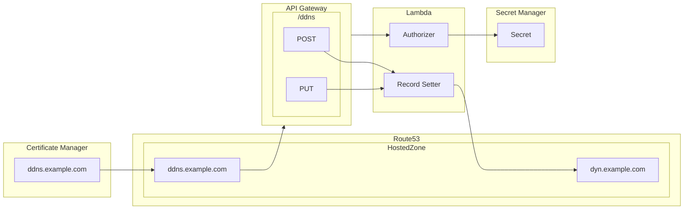
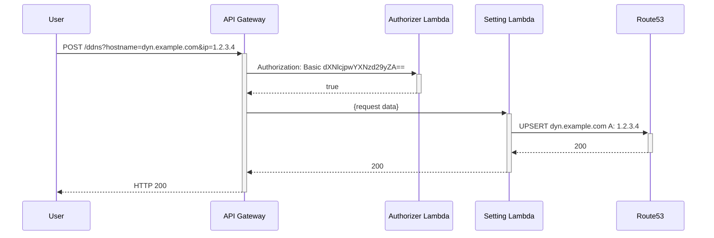

# Dyn53
Dyn53 is a serverless application for dynamic DNS.

## What
API Gateway exposes two identical api calls (`POST` and `PUT` to `/ddns`) under the `ddns.` sub domain name. This will permit updating any record in the specified hosted zone.



## Deploy
This application is fully SAM compatible and can be deployed with the following:
```sh
sam deploy --config-file ./samconfig.toml --config-env prod --region {region} --profile {profile} --parameter-overrides 'HostedZoneId=Z1234' 'DomainName=example.com' 'DynamicSubDomain=dyn'
```

## Why
Unifi Dynamic DNS options don't natively support Route53 (understandably), and there seems to be some terrible solutions out there so I made my own.

## How
Basic sequence is as follows:


## Contributing
It's GNU GPLv3, feel free to send pull requests or file issues.

### Planned contributions
* Parameterizing API domain name ([#1](https://github.com/AV-IO/Dyn53/issues/1))
* Option to opt-out of secret manager ([#2](https://github.com/AV-IO/Dyn53/issues/2))
  * While proper, it is by far the most expensive part of this deployment, and should be up to the user's choice
* Restrict Permissions to a set of sub domain names instead of to an entire hosted zone ([#3](https://github.com/AV-IO/Dyn53/issues/3))
